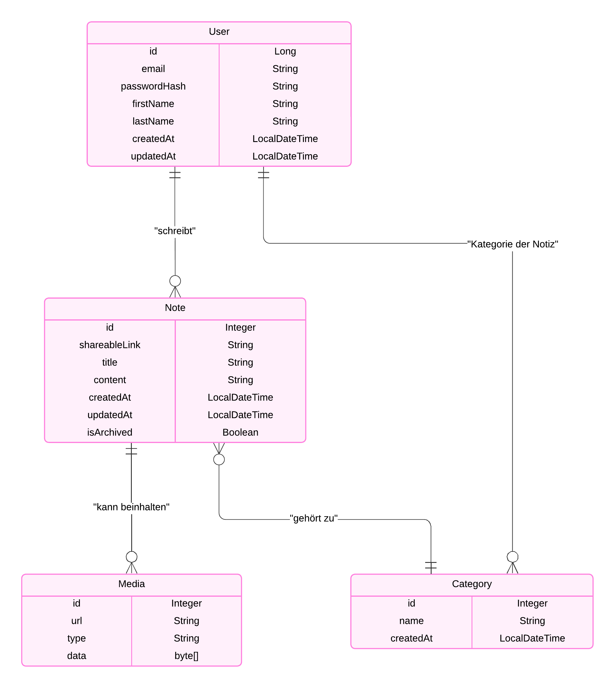

# My REST API

Eine einfache REST-API, die mit Java Spring Boot erstellt wurde. Diese API bietet grundlegende CRUD-Operationen (Create, Read, Update, Delete) für eine Ressource an. In diesem Beispiel verwenden wir eine `User`-Ressource.

## Voraussetzungen

- Java 17 oder 21 (LTS-Version empfohlen)
- Maven 3.6+ (falls nicht über eine IDE verwaltet)
- Spring Boot 3.x

## Technologien

- **Spring Boot**: Framework für die schnelle Entwicklung von Java-Anwendungen
- **Spring Web**: Ermöglicht die Erstellung von REST-Endpunkten
- **Spring Data JPA**: Für den Zugriff auf die Datenbank
- **H2 Datenbank** (optional): In-Memory-Datenbank für Tests
- **Maven**: Build-Management-Tool

## Installation

1. **Projekt klonen**:
   ```bash
   git clone https://github.com/dein-benutzername/my-rest-api.git
   cd my-rest-api

### Notes Management System

Ein leistungsstarkes Java Spring Boot-System zum Verwalten von Benutzern, Notizen, Medien und Kategorien.

## Inhaltsverzeichnis
- [Überblick](#überblick)
- [Features](#features)
- [Voraussetzungen](#voraussetzungen)
- [Installation](#installation)
- [Technologien](#technologien)
- [API-Endpunkte](#api-endpunkte)
- [Nutzung](#nutzung)
- [Roadmap](#roadmap)
- [Autoren](#autoren)

---
## Überblick
Das Notes Management System ermöglicht es Benutzern, ihre Notizen effizient zu organisieren, zu teilen und mit Medien zu verknüpfen. Es unterstützt das Hinzufügen von Kategorien und eine sichere Benutzerverwaltung.
Der Nutzer kann Kategorien erstellen und unter diesen Kategorien mehrere Notizen hinzufügen. 
Eine Notiz kann zuätzlich Bilder und Links beinhalten


## Features
- **Benutzerverwaltung**: Registrierung, Anmeldung, Passwort-Hashing.
- **Notizenverwaltung**: Erstellen, Bearbeiten, Löschen von Notizen.
- **Kategorien**: Organisieren von Notizen in Kategorien.
- **Medienunterstützung**: Hinzufügen von Medien zu Notizen (z. B. Bilder, Links).
- **Teilen von Notizen**: Generieren von teilbaren Links.
- **Archivieren von Notizen**: Verwalten von inaktiven Notizen.

## Datenbank Schema


---

   
